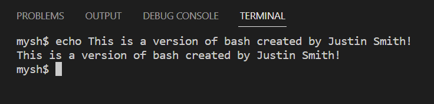
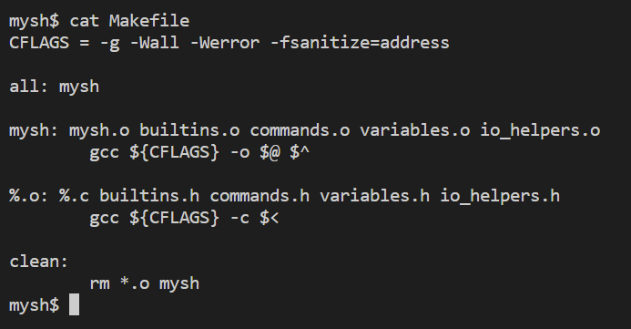
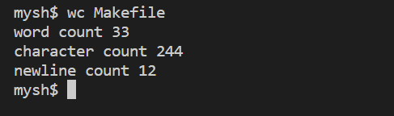
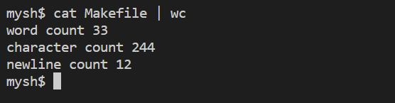
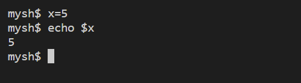
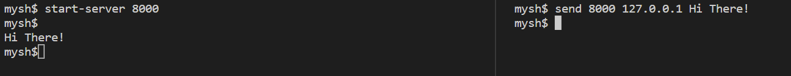

# myshell
My custom-built Bash implementation, written in C.
The program is designed to mimic the behavior of a standard Unix shell.
 
 This project offers a unique take on fundamental command-line functionalities, redefining commands like wc and cat with custom implementations.
 
 
 This bash version supports an array of functionalities such as pipes, variables, and a messaging system between instances.
 
 
 
 Created Winter 2022 as part of CSC209 at The University of Toronto.
